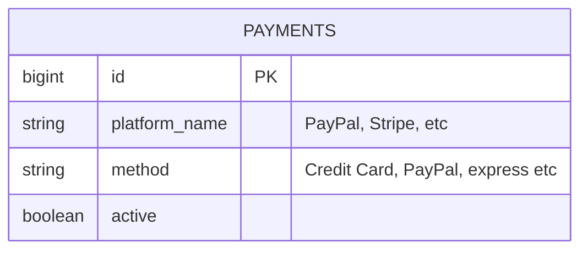
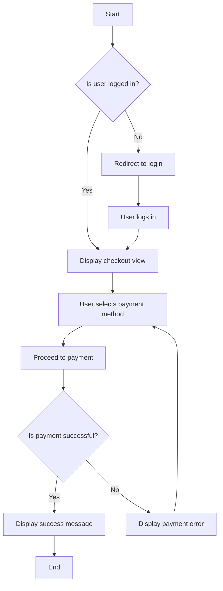
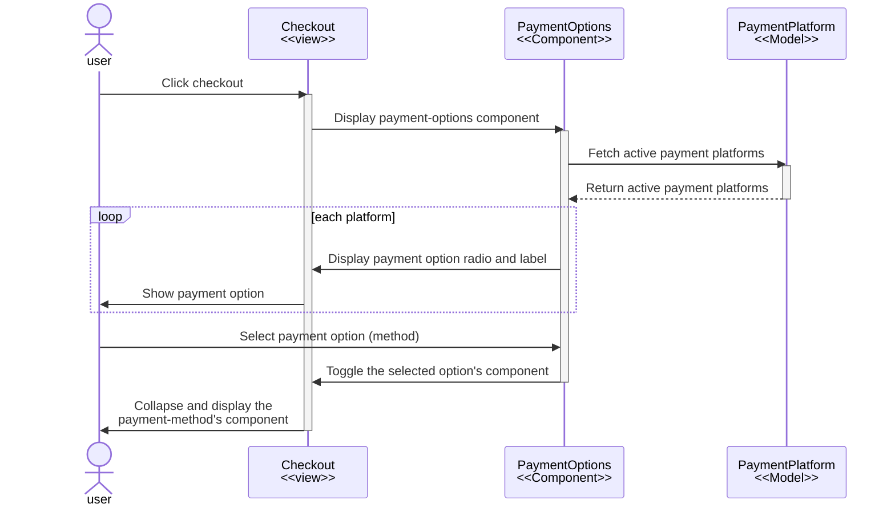
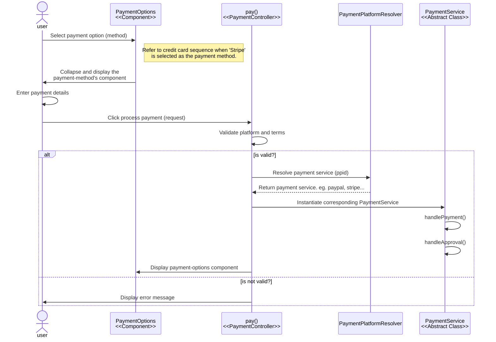
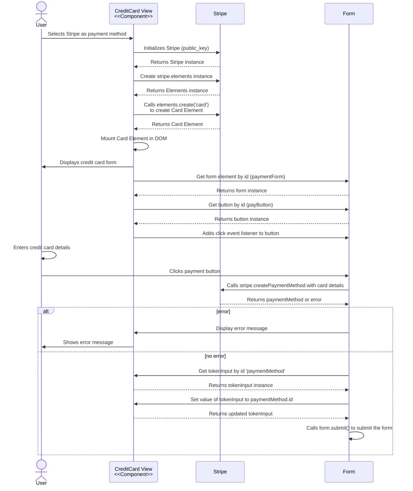
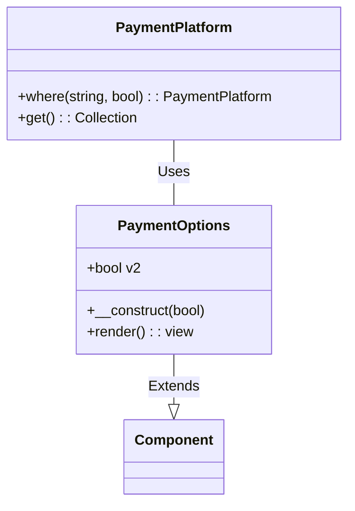
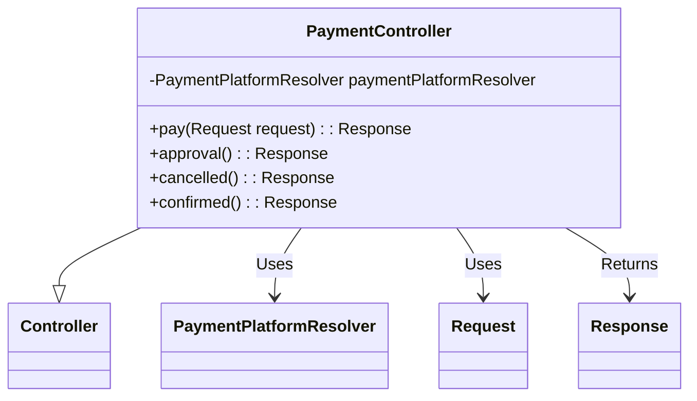

# NAYKEL Payment Management Package

<!-- TOC -->

- [Entity Relationship Diagram](#entity-relationship-diagram)
- [User checkout and payment process flowchart](#user-checkout-and-payment-process-flowchart)
- [Sequence Diagrams](#sequence-diagrams)
    - [Sequence diagram for payment options in checkout process](#sequence-diagram-for-payment-options-in-checkout-process)
    - [Sequence diagram for stipe credit card payment](#sequence-diagram-for-stipe-credit-card-payment)

<!-- /TOC -->

`ppid` Payment Platform ID

## Entity Relationship Diagram

**method** is used for both the label, and to identify the collapse component to display on the front-end.

The name `method` may be a bit deceiving as it is used to identify the component to display on the
front-end as well as the label for the payment method.

For example, if the method is 'Credit Card' then the label for the payment method will be 'Credit
Card' and the component to be displayed will be `credit-card`.

## User checkout and payment process flowchart

## Sequence Diagrams

### Sequence diagram for payment options in checkout process

This diagram illustrates the sequence of events in the checkout to display the available payment
options. It shows how the system, specifically the `PaymentOptions` component, fetches active
payment methods from the `PaymentPlatform` model (which represents data in the database). These
payment methods are then presented to the user in the Checkout view. The user can then select
their preferred payment method from the provided options for further processing.

** method is used for both the label, and to identify the collapse component to display on the front-end.

---
---
---
---
---
---
---

This diagram assumes you are logged, on the checkout page about to select a payment method.

### Sequence diagram for stipe credit card payment

** `paymentForm` is the id of the form element in the DOM

---
---
---
---
---
---
---
---

