# NAYKEL Payment Management Package

- [User checkout and payment process flowchart](#user-checkout-and-payment-process-flowchart)
- [Sequence Diagrams](#sequence-diagrams)
  - [Sequence diagram for payment options in checkout process](#sequence-diagram-for-payment-options-in-checkout-process)
  - [Sequence diagram for stipe credit card payment](#sequence-diagram-for-stipe-credit-card-payment)

`ppid` Payment Platform ID

## User checkout and payment process flowchart

The user must be logged in to proceed with the checkout process. If the user is not logged in, they
are redirected to the login page. Once logged in, the user can proceed to the checkout page. 

## Sequence Diagrams

### Sequence diagram for payment options in checkout process

This diagram illustrates the sequence of events in the checkout to display the available payment
options. It shows how the system, specifically the `PaymentOptions` component, fetches active
payment methods from the `PaymentPlatform` model (which represents data in the database). These
payment methods are then presented to the user in the Checkout view. The user can then select
their preferred payment method from the provided options for further processing.

** method is used for both the label, and to identify the collapse component to display on the front-end.

This diagram assumes you are logged, on the checkout page about to select a payment method.

```mermaid
sequenceDiagram
    actor user
    participant options as PaymentOptions<br><<Component>>
    participant controller as pay()<br><<PaymentController>>
    participant resolve as PaymentPlatformResolver
    participant service as PaymentService<br><<Abstract Class>>

    user->>options: Select payment option (method)
    note right of options: Refer to credit card sequence  when 'Stripe' <br> is selected as the payment method.
    options->>user: Collapse and display the <br> payment-method's component
    user->>user: Enter payment details
    user->>controller: Click process payment (request)
    controller->>controller: Validate platform and terms
    alt is valid?
        controller->>resolve: Resolve payment service (ppid)
        resolve-->>controller: Return payment service. eg. paypal, stripe...
        controller->>service: Instantiate corresponding PaymentService
        service->>service: handlePayment()
        service->>service: handleApproval()
        controller->>options: Display payment-options component
    else is not valid?
        controller->>user: Display error message
    end
```

### Sequence diagram for stipe credit card payment

** `paymentForm` is the id of the form element in the DOM

